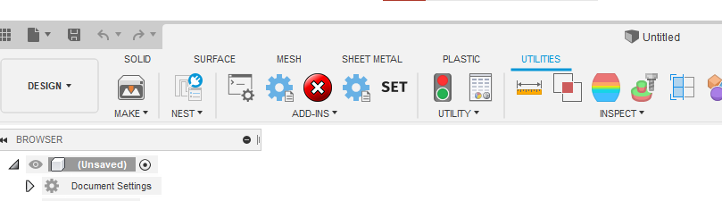
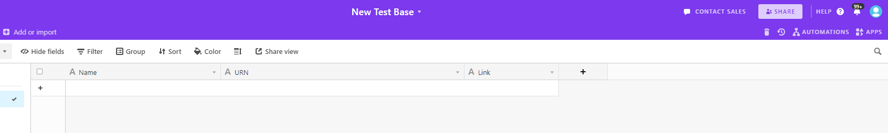
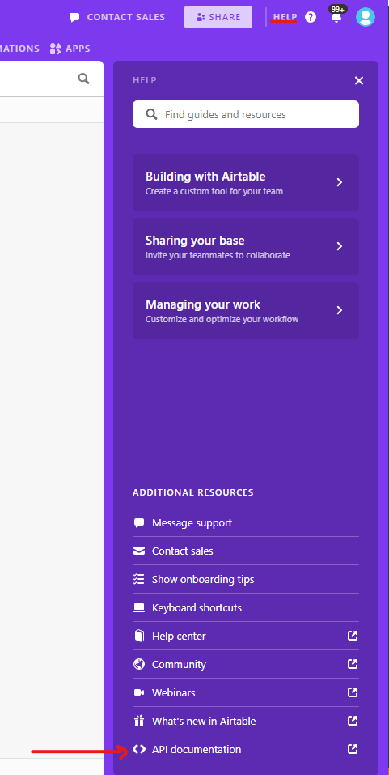
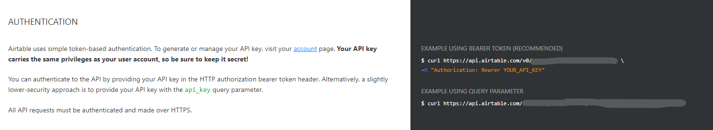
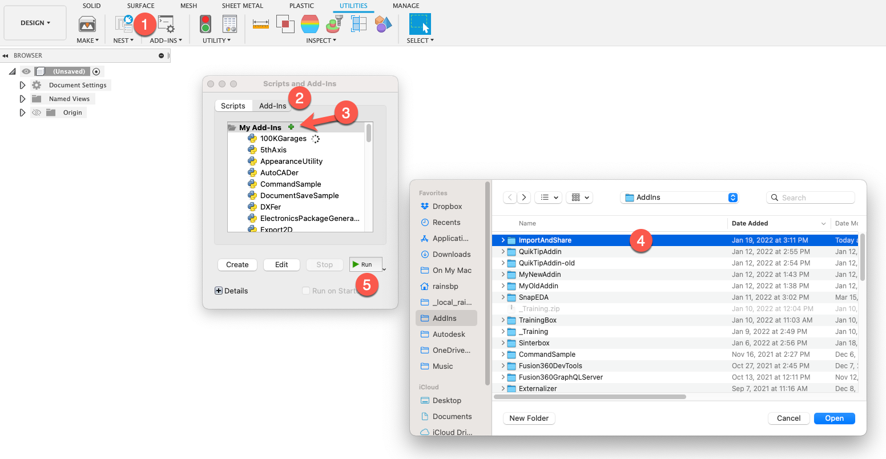

Import And Share
================
Imports STEP files to current directory and generates share link with options for adding materials and pushing to AirTable.

This Add_In allows for the batch import of STEP files, and will generate share links for all imported files. In addition, functionality is included to apply appearances automatically on import, and it also includes the option to export the share links as either a CSV file, or have them pushed out to an AirTable base.

`Learn More <https://help.autodesk.com/view/fusion360/ENU/?guid=GUID-049CC6A8-10A5-47AD-B5DE-10B29721548A>`_

Usage
-----
At the end of this section there are instructions for how to set up an AirTable base, retrieve your API key, and find the base URL if you wish to use that functionality. If not then continue below.

Run the app.

**Step 1: The first step is to run the "Set Parameters" command.**

- Within the window that this launches, you will find options to save to AirTable or as a CSV. 
- If you choose to save to AirTable, you will need to provide an API key and a URL for the base you wish to push to.
- The second tab contains a table with three columns. This table is for applying any materials that you wish to specific bodies in the files you wish to import.
  - The first column is the name of the body that you wish to add an appearance to. 
  - The second column is the name of an Appearance (must be in your 'Favorites' folder) that you wish to apply the Appearance to.
  - The thrid column is a check box. If it remains unchecked, it will look for any bodies which contain the text in the first column to apply the Appearance to.
    - As an example by placing "ft I-Beam Section" in the first column, and leaving the box unchecked, the Add-In would apply the chosen material to "2ft I-Beam Section", "4.5ft I-Beam Section", "120ft I-Beam Section", etc. all in the same run.

**Step 2: Once you have set the parameters, run the "Import Folder" command.**

- You will be prompted to select a directory. All STEP files in this directory will be imported to the active project and a share link will be created
- Materials will be applied as files are imported if you set such things in the "Set Parameters" command.
- If you selected to output as CSV, then the resulting Public-Share-links and Version ID's will be stored in a csv file in the selected folder with the original STEP files.
- If you selected to push results to Airtable, then the resulting Public-Share-links and Version ID's will be shared the base specified.

**Step 3 (Optional): If the Add-In reports errors, you may use the "Close-All" command to close any files that remain open, fix any errors, then run the "Import Folder" command again.**

**Step 4 (Optional): If appropriate, you may also choose to use the "Process Remaining" command to process any files that remain open or may have been skipped in error.**

For AirTable use
^^^^^^^^^^^^^^^^
If you wish to post your results to AirTable, first you will need to set up an empty base like so:

It may contain other fields, but these three must be present as "single line text" fields. You will also need the API URL which you can find by clicking "Help," then selecting "API Documentation."

Scroll down to the "AUTHENTICATION" section and your URL can be found here after the word "curl":

**Do NOT** use the URL under "EXAMPLE USING QUERY PARAMETER" as it won't work.

Lastly, you can find your API key on your account page, as it mentions (and links to) in the image above.

Installation
------------
- `Download or clone the latest version <https://github.com/tapnair/ImportAndShare/archive/refs/heads/master.zip>`_
- Unzip the archive to a permanent location on your computer
- It is important that the directory be named *ImportAndShare*.

*Note: If you are downloading the zip file from github it typically appends -master to the folder name.
You must rename the folder for Fusion 360 to recognize the addin.*

After you download and extract the zip file:

1.	Open the scripts and add-ins dialog box
2.	Select the add-ins tab in the top of the dialog
3.	Click the little green plus button to add the add-in
4.	Select the directory named Export2D and click the open button
5.	With it selected click the run button at the bottom of the dialog

Attribution
-----------
This Add-In is a fork of `ImportAndShare <https://github.com/tapnair/ImportAndShare>`_ by `Patrick Rainsberry <patrick.rainsberry@autodesk.com>`_. It relies heavily on his original work, and Patrick made significant contributions to helping get this version working as well. Thanks Patrick!

This Add-In also relies on the python `requests` library, for it's ability to push info to AirTable.

**Huge** thanks to the above contributors. 

License
-------
THE SOFTWARE IS PROVIDED "AS IS", WITHOUT WARRANTY OF ANY KIND, EXPRESS OR IMPLIED,
INCLUDING BUT NOT LIMITED TO THE WARRANTIES OF MERCHANTABILITY, FITNESS FOR A PARTICULAR PURPOSE AND NONINFRINGEMENT.
IN NO EVENT SHALL THE AUTHORS OR COPYRIGHT HOLDERS BE LIABLE FOR ANY CLAIM, DAMAGES OR OTHER LIABILITY,
WHETHER IN AN ACTION OF CONTRACT, TORT OR OTHERWISE, ARISING FROM, OUT OF OR IN CONNECTION WITH THE SOFTWARE
OR THE USE OR OTHER DEALINGS IN THE SOFTWARE.

`MIT License`_

.. _MIT License: ./LICENSE

Authors
-------
`Import And Share` was originally written by `Patrick Rainsberry <patrick.rainsberry@autodesk.com>`_.

This fork is modified with functionality added by `Ironic Mango Designs <https://IronicMango.com>`_.

